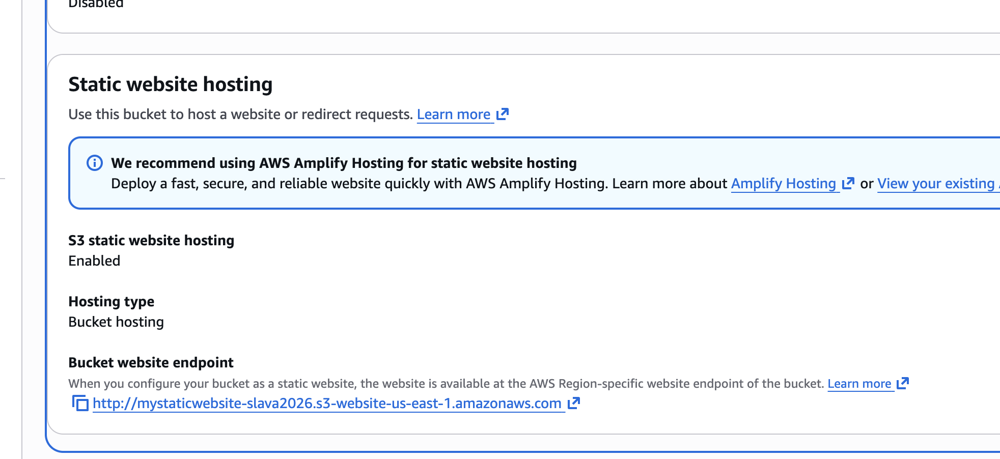
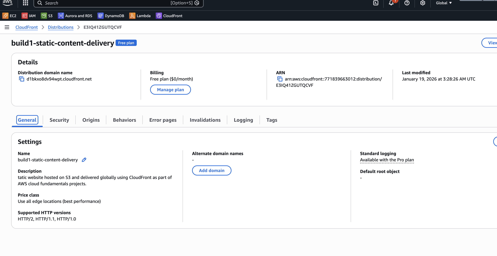
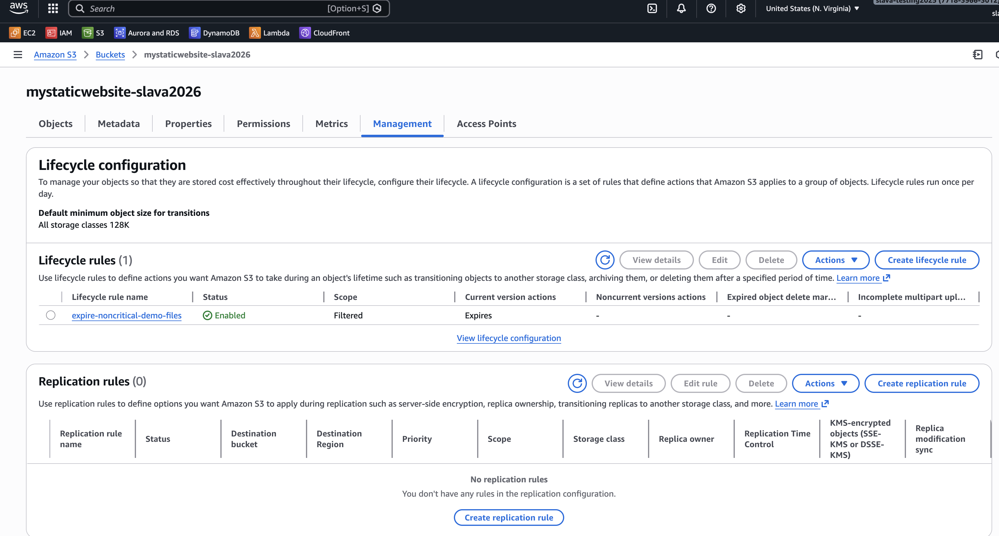

# Build 1 — Static & Content Delivery (S3 + CloudFront + Lifecycle)

## Project Goal
Demonstrate how static content can be hosted, delivered globally, and managed cost-effectively using core AWS services.

---

## Exercise 1: Static Website Hosting on Amazon S3
**Goal:** Host static content using object storage.

**What I did:**
- Created an S3 bucket and uploaded static site files (HTML + image)
- Enabled S3 static website hosting
- Configured index.html as the root document

**What I learned:**
- Difference between S3 object access and static website hosting
- Importance of correct Content-Type metadata
- How S3 serves static content without compute

---

## Exercise 2: Global Content Delivery with CloudFront
**Goal:** Improve performance and security using a CDN.

**What I did:**
- Created a CloudFront distribution using the S3 website endpoint as the origin
- Configured CloudFront to serve content from the S3-hosted static website
- Verified content delivery through the CloudFront domain

**What I learned:**
- How CloudFront caches content at edge locations
- Why CloudFront is preferred over direct S3 access in production
- How HTTPS is handled at the edge

---

## Exercise 3: Cost Management with S3 Lifecycle Policies
**Goal:** Understand basic storage cost optimization.

**What I did:**
- Created an S3 lifecycle rule scoped to a safe prefix
- Configured expiration/transition behavior for non-critical objects

**What I learned:**
- Lifecycle rules must be scoped carefully
- How AWS automates long-term cost control
- Why lifecycle policies are essential at scale

---

## Architecture Summary
- Amazon S3 for static content storage
- Amazon CloudFront for global delivery and HTTPS
- S3 Lifecycle rules for cost management

---

## Evidence
Screenshots included showing:
- S3 static website hosting configuration
- CloudFront distribution setup
- Website successfully loading via CloudFront
- S3 lifecycle rule configuration
