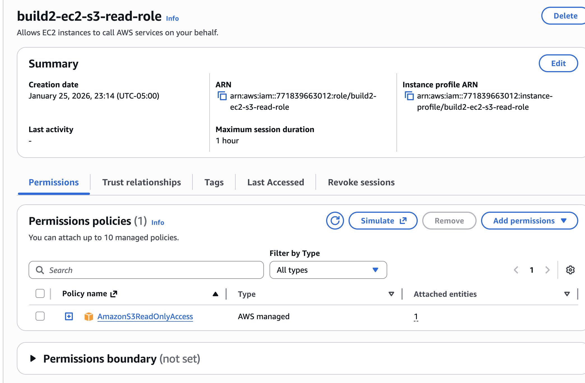
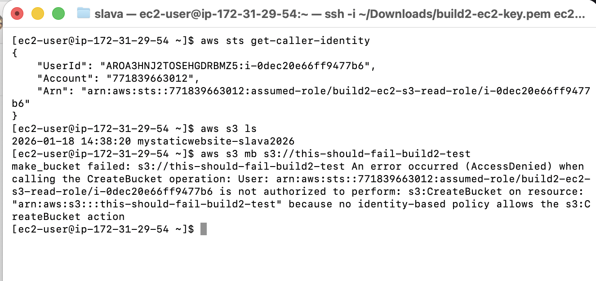

# Build 2 — Secure Compute Access (EC2 + IAM Roles)

## Project Goal
Demonstrate how compute resources in AWS are accessed and secured using **IAM roles and least-privilege permissions**, without relying on static credentials.

---

## Exercise 1: Launch a Secure EC2 Instance
**Goal:** Provision compute securely using Amazon EC2.

**What I did:**
- Launched an EC2 instance running Amazon Linux 2023
- Used a key pair for SSH access
- Verified the instance was running and passed all health checks

**What I learned:**
- EC2 is just compute — security is layered on top
- Instance state and system checks are the first indicators of a healthy launch
- Even simple compute setups require careful access planning


---

## Exercise 2: Create an IAM Role for EC2
**Goal:** Provide AWS service access without using access keys.

**What I did:**
- Created an IAM role (`build2-ec2-s3-read-role`) for EC2
- Attached the AWS-managed `AmazonS3ReadOnlyAccess` policy
- Scoped permissions to read-only access for S3

**What I learned:**
- IAM roles allow AWS services to assume permissions securely
- Managed policies are useful starting points, but should be scoped carefully
- Roles replace the need for long-lived credentials on instances



---

## Exercise 3: Attach IAM Role to EC2 Instance
**Goal:** Bind identity and permissions to compute.

**What I did:**
- Attached the IAM role directly to the running EC2 instance
- Verified the role was associated with the instance profile

**What I learned:**
- Permissions are evaluated at runtime through the role
- Identity is decoupled from the instance itself
- This pattern is foundational for secure AWS architectures


---

## Exercise 4: Secure Access via SSH
**Goal:** Access the instance without exposing AWS credentials.

**What I did:**
- Connected to the EC2 instance via SSH using the key pair
- Verified successful login to the Amazon Linux environment

**What I learned:**
- SSH access is separate from AWS service permissions
- OS-level access and AWS-level identity are distinct layers
- Proper key management is essential even in basic setups


---

## Exercise 5: Verify S3 Read Access via IAM Role
**Goal:** Prove the EC2 instance can access AWS services through its role.

**What I did:**
- Used the AWS CLI from inside the EC2 instance
- Listed S3 buckets using `aws s3 ls`
- Confirmed access worked without configuring credentials

**What I learned:**
- IAM roles provide temporary credentials automatically
- The AWS CLI transparently uses the instance role
- This is the correct pattern for production workloads


---

## Exercise 6: Enforce Least Privilege
**Goal:** Confirm that permissions are limited as intended.

**What I did:**
- Attempted to create a new S3 bucket from the EC2 instance
- Received an AccessDenied error

**What I learned:**
- Least privilege must be verified, not assumed
- Read-only permissions behaved exactly as designed
- Proper IAM design prevents accidental or malicious actions



---

## Exercise 7: Restrict Access to a Single S3 Bucket (Bucket-Specific Policy)
**Goal:** Ensure the EC2 instance can access **only one specific S3 bucket** while all other buckets are denied.

**What I did:**
- Created a second S3 bucket (`build2-slava2026-deny-test`) to act as a negative test case  
- Removed the broad AWS-managed `AmazonS3ReadOnlyAccess` policy from the EC2 IAM role  
- Created and attached a **custom, bucket-specific IAM policy** granting read-only access to `mystaticwebsite-slava2026`  
- Verified permissions from inside the EC2 instance using the AWS CLI  

**IAM Policy (Bucket-Specific Read-Only Access):**
```json
{
  "Version": "2012-10-17",
  "Statement": [
    {
      "Sid": "AllowListSpecificBucket",
      "Effect": "Allow",
      "Action": "s3:ListBucket",
      "Resource": "arn:aws:s3:::mystaticwebsite-slava2026"
    },
    {
      "Sid": "AllowReadObjectsInSpecificBucket",
      "Effect": "Allow",
      "Action": "s3:GetObject",
      "Resource": "arn:aws:s3:::mystaticwebsite-slava2026/*"
    }
  ]
}
```

**What I learned:**
- Managed policies are often too permissive for real-world workloads
- Least privilege is best enforced by narrowing allowed resources, not by adding explicit deny rules
- Bucket-specific IAM policies provide precise control over S3 access and reduce the risk of unintended data exposure


---

## Architecture Summary
- Amazon EC2 for compute (Amazon Linux 2023)
- IAM role attached to EC2 for identity-based access
- Custom, bucket-specific IAM policy enforcing least-privilege S3 access
- SSH for secure instance access
- AWS CLI used from inside EC2 for runtime permission verification

---

## Evidence
Screenshots included showing:
- EC2 instance running
- IAM role creation and permissions
- IAM role attached to EC2
- Successful SSH access
- S3 read access via role
- Access denied when exceeding permissions
- Bucket-specific access enforced
