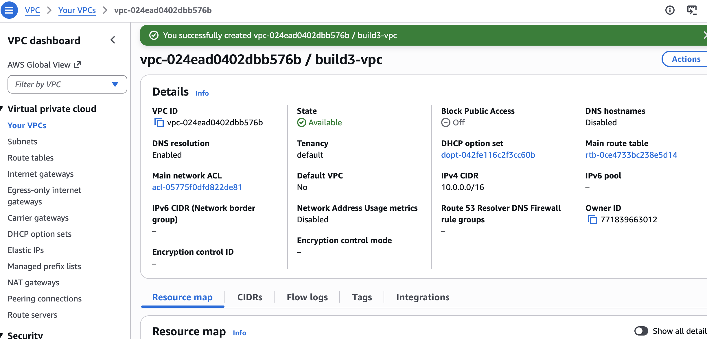
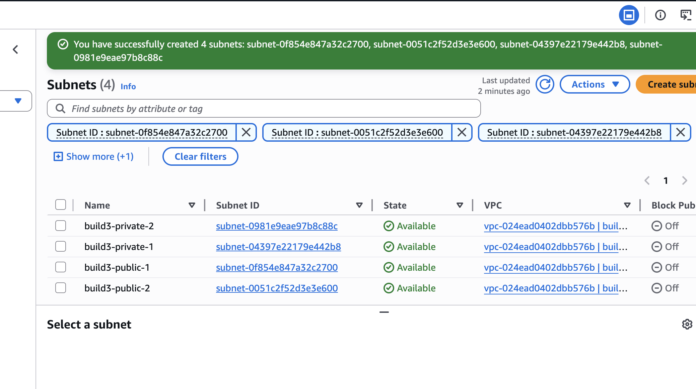
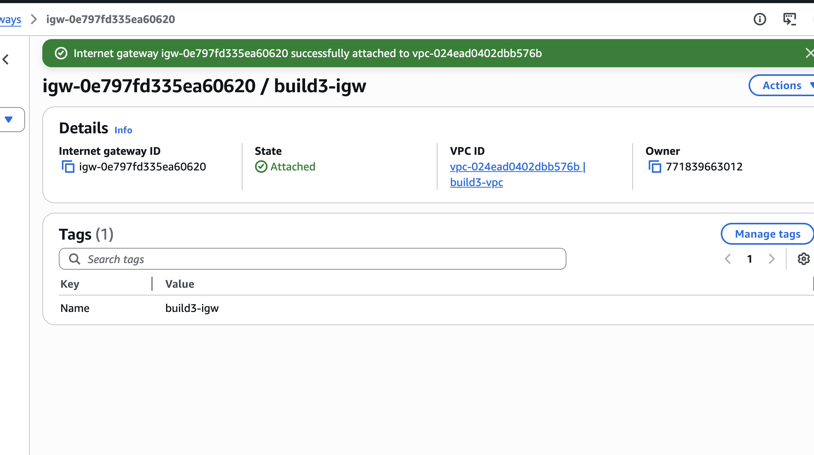
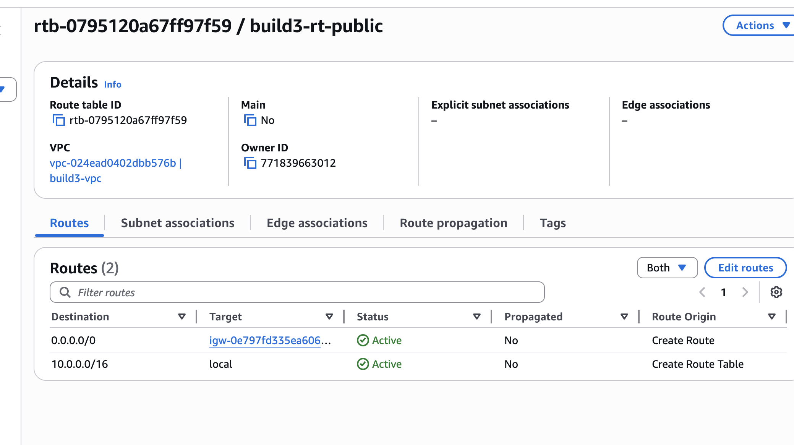
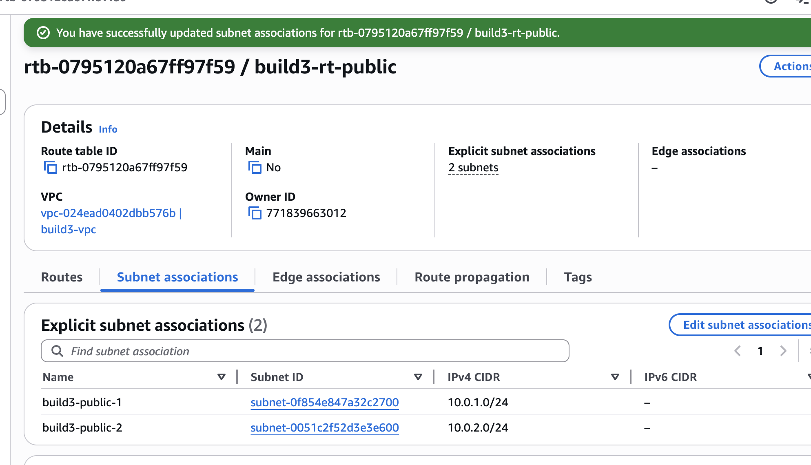
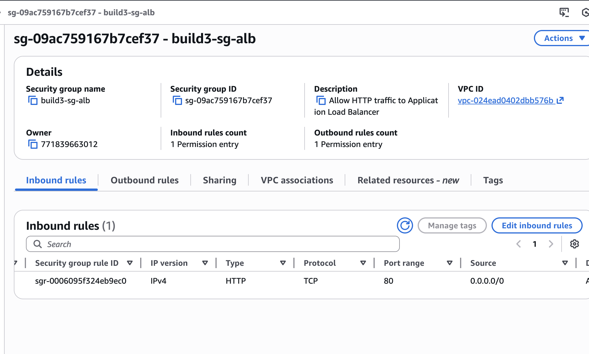
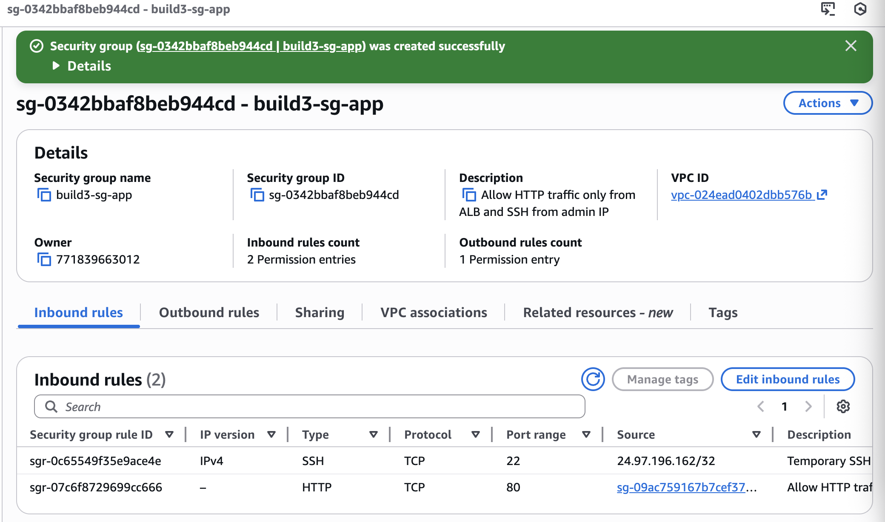
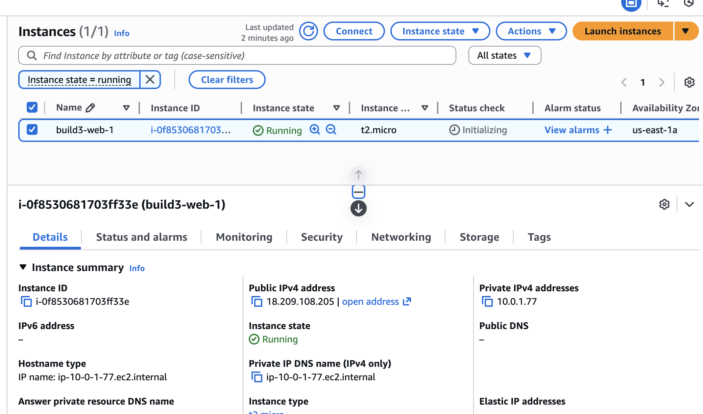
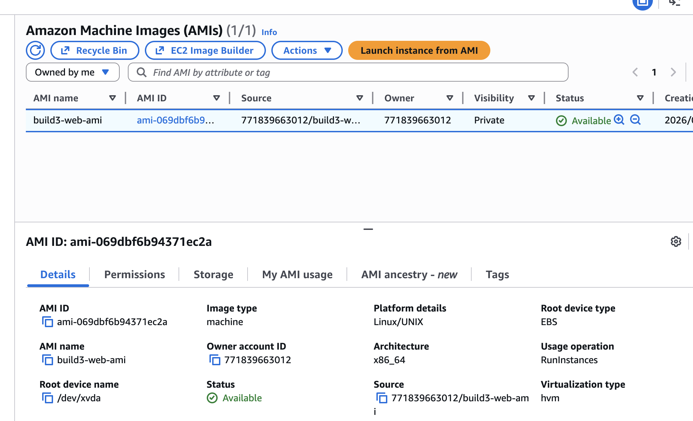

# Build 3 — Networking, Availability & Scaling (VPC + ALB + Auto Scaling)

## Project Goal
Demonstrate how to build a highly available, secure, and self-healing web architecture using VPC networking, Application Load Balancer, and Auto Scaling.

---

## Exercise 1: VPC & Subnet Architecture
**Goal:** Design a secure network layout with public and private subnets across multiple Availability Zones.

**What I did:**
- Created a custom VPC (`10.0.0.0/16`)
- Created 2 public subnets (for ALB)
- Created 2 private subnets (for EC2 instances)
- Attached an Internet Gateway
- Created a public route table with `0.0.0.0/0 → IGW`
- Associated public subnets with the public route table
- Enabled auto-assign public IP for public subnets only

**What I learned:**
- How public vs private subnets are defined by route tables
- Why load balancers belong in public subnets
- Why application servers should live in private subnets
- How subnet design supports high availability across AZs

---

## Exercise 2: Secure Traffic Boundaries with Security Groups
**Goal:** Enforce proper traffic flow between ALB and application servers.

**What I did:**
- Created ALB security group allowing HTTP from `0.0.0.0/0`
- Created app server security group allowing:
  - HTTP only from ALB security group
  - SSH only from my IP
- Explicitly did NOT allow HTTP from the internet to EC2

**What I learned:**
- How security group referencing works
- Why application servers should not be publicly accessible
- How to enforce least-privilege network access

---

## Exercise 3: Golden AMI Creation
**Goal:** Create a reusable web server image for scaling.

**What I did:**
- Launched EC2 instance in public subnet (temporary build instance)
- Installed Apache and configured a test web page
- Created a custom AMI (`build3-web-ami`)

**What I learned:**
- How AMIs enable repeatable infrastructure
- Why Auto Scaling requires immutable machine images
- How golden images reduce configuration drift

---

## Exercise 4: Application Load Balancer Setup
**Goal:** Distribute traffic across multiple instances and enable health monitoring.

**What I did:**
- Created target group (`build3-tg-web`)
- Configured HTTP health checks (`/`)
- Created internet-facing ALB in public subnets
- Attached listener (HTTP → target group)
- Verified DNS endpoint worked in browser

**What I learned:**
- How ALB routes traffic to healthy targets
- How health checks determine instance availability
- Why load balancers are critical for high availability

---

## Exercise 5: Auto Scaling & Self-Healing
**Goal:** Automatically scale and replace failed instances across multiple AZs.

**What I did:**
- Created Launch Template using custom AMI
- Created Auto Scaling Group across private subnets
- Set Desired = 2, Min = 1, Max = 3
- Enabled ELB health checks
- Manually terminated one instance to test recovery
- Observed automatic replacement and re-registration

**What I learned:**
- How Launch Templates standardize instance configuration
- How ASG maintains desired capacity
- How ELB health checks integrate with Auto Scaling
- What self-healing infrastructure looks like in practice

---

## Architecture Summary

- Custom VPC with public & private subnets
- Internet Gateway + public route table
- Application Load Balancer in public subnets
- EC2 instances in private subnets
- Launch Template for consistent deployments
- Auto Scaling Group for resilience
- Target group health checks for monitoring

---

## Evidence

Screenshots included showing:
- VPC and subnet configuration
- Proper route table setup
- Security group isolation
- ALB configuration and DNS response
- Launch template creation
- Auto Scaling Group configuration
- Multiple instances running across AZs
- Automatic instance replacement after termination
