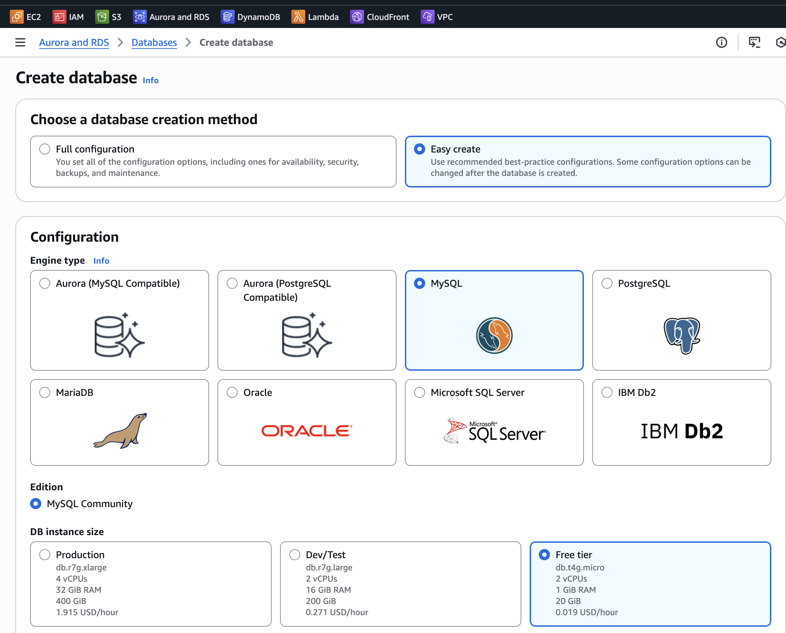
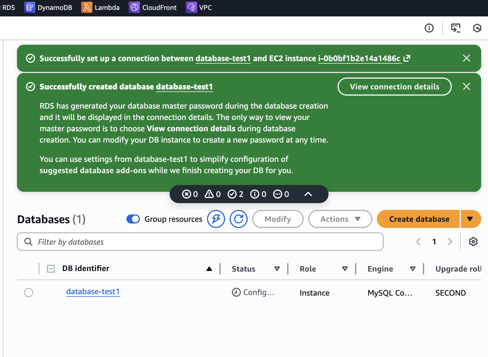
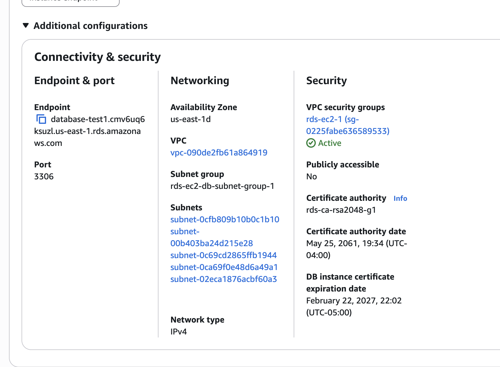
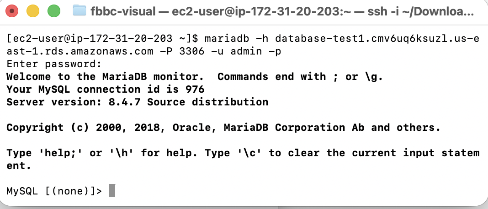
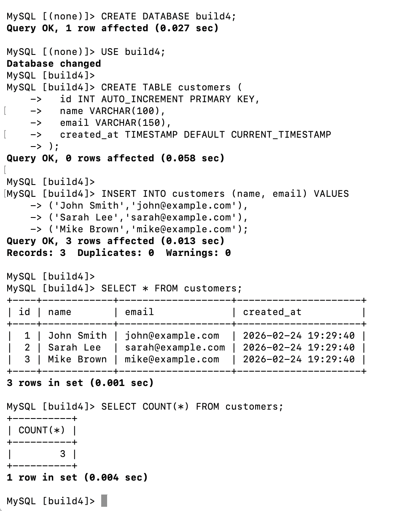
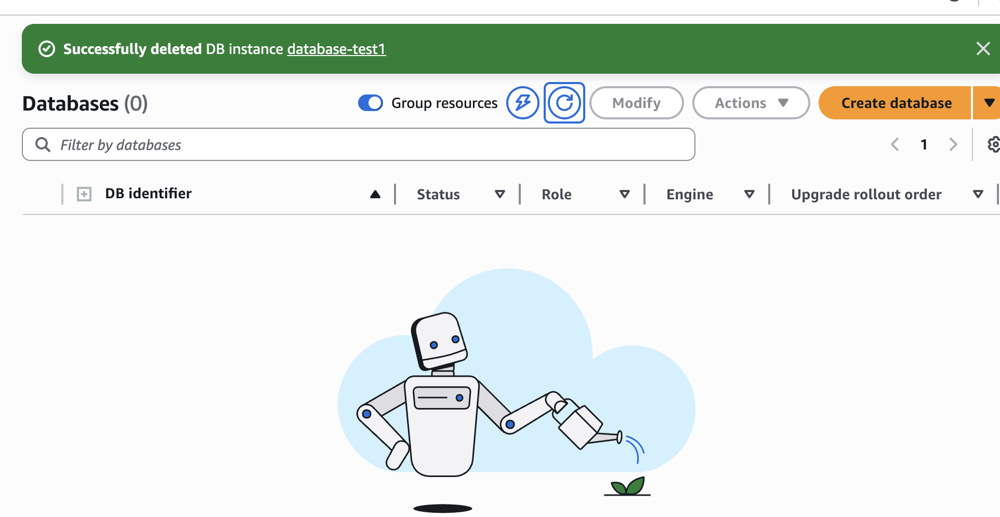

# 🧱 Build 4 — Private RDS (MySQL) with EC2 Connectivity

## Project Goal
Demonstrate how a private database is deployed securely inside a VPC and accessed internally from EC2 — without exposing the database to the public internet.

---

## Exercise 1: Create a Private RDS MySQL Instance
**Goal:** Deploy a managed relational database securely inside a VPC.

**What I did:**
- Created a MySQL RDS instance using Easy Create
- Selected the smallest available instance class
- Enabled “Connect to an EC2 compute resource”
- Allowed AWS to automatically configure networking and security groups
- Confirmed public access was set to **No**

**What I learned:**
- RDS networking is tightly integrated with VPC configuration
- Public accessibility is optional and should be avoided for production-style databases
- Security groups are the primary mechanism controlling database access

---

## Exercise 2: Confirm EC2 Connection Setup
**Goal:** Verify that RDS was linked correctly to the EC2 instance.

**What I did:**
- Confirmed the green banner indicating successful connection
- Verified the EC2 instance was selected during RDS creation

**What I learned:**
- AWS can automatically wire security groups when EC2 is selected
- Internal connectivity is simplified when using the EC2 connection option

---

## Exercise 3: Verify Private Connectivity
**Goal:** Ensure the database is isolated from public access.

**What I did:**
- Opened the RDS Connectivity & Security tab
- Verified:
  - Status = Available
  - Public access = No
  - Port 3306
  - Correct VPC and subnet group
  - Security group attached

**What I learned:**
- “Available” does not automatically mean “secure”
- Subnet placement and security groups together enforce isolation
- Proper VPC design prevents accidental public exposure

---

## Exercise 4: Connect to RDS from EC2
**Goal:** Prove internal VPC communication works securely.

**What I did:**
- Installed the MariaDB client on EC2:
  sudo dnf install -y mariadb105
- Connected to the database using:
  mariadb -h <RDS-endpoint> -P 3306 -u admin -p
- Authenticated successfully and reached the MySQL prompt

**What I learned:**
- Internal DNS endpoints resolve only inside the VPC
- Security groups successfully allowed traffic from EC2 to RDS
- The database remained unreachable from outside the VPC

---

## Exercise 5: Execute SQL Operations
**Goal:** Validate full database functionality.

**What I did:**
- Created a database (build4)
- Created a customers table
- Inserted sample records
- Queried the table and verified results

**What I learned:**
- Connectivity alone is not enough — application-level operations must succeed
- RDS behaves like a standard MySQL database
- Managed services abstract infrastructure, not database logic

---

## Exercise 6: Clean Up Resources
**Goal:** Prevent unnecessary AWS charges.

**What I did:**
- Terminated the EC2 instance
- Deleted the RDS instance
- Skipped final snapshot and backup retention

**What I learned:**
- RDS continues billing while running
- Cleanup is a critical part of responsible cloud usage
- Infrastructure lifecycle management matters as much as deployment

---

## Architecture Summary
- Amazon RDS (MySQL) deployed in a private subnet
- EC2 instance in a public subnet for controlled access
- Security groups controlling port 3306 traffic
- Internal VPC routing between compute and database
- No public database exposure

---

## Evidence
Screenshots included showing:
- RDS configuration
- EC2 connection success
- Private connectivity settings
- Successful database connection
- SQL operations
- Resource cleanup
